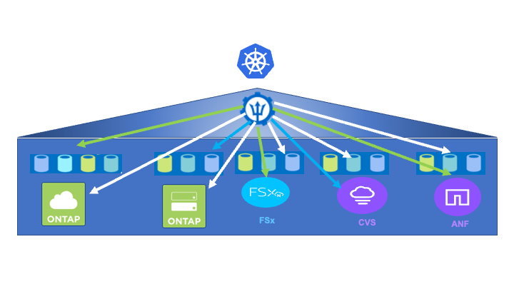

= Astra Trident Overview
:hardbreaks:
:nofooter:
:icons: font
:linkattrs:
:imagesdir: ./../../media/

//
// This file was created with NDAC Version 0.9 (June 4, 2020)
//
// 2020-06-25 14:31:33.563897
//

Astra Trident is a fully supported, open-source storage orchestrator for containers and Kubernetes distributions, including Anthos. Trident works with the entire NetApp storage portfolio, including NetApp ONTAP, and it also supports NFS and iSCSI connections. Trident accelerates the DevOps workflow by allowing end users to provision and manage storage from their NetApp storage systems without requiring intervention from a storage administrator.

An administrator can configure a number of storage backends based on project needs and storage system models that enable advanced storage features, including compression, specific disk types, and QoS levels that guarantee a certain level of performance. After they are defined, these backends can be used by developers in their projects to create persistent volume claims (PVCs) and to attach persistent storage to their containers on demand.

Astra Trident has a rapid development cycle and, like Kubernetes, is released four times a year.

The documentation of the latest version of Astra Trident can be found https://docs.netapp.com/us-en/trident/index.html[here]. A support matrix for what version of Trident has been tested with which Kubernetes distribution can be found https://docs.netapp.com/us-en/trident/trident-get-started/requirements.html#supported-frontends-orchestrators[here].

Starting with the 20.04 release, Trident setup is performed by the Trident operator. The operator makes large scale deployments easier and provides additional support including self healing for pods that are deployed as a part of the Trident install.

With the 22.04 release, a Helm chart was made available to ease the installation of the Trident Operator.

For Astra Trident installation details please see https://docs.netapp.com/us-en/trident/trident-get-started/kubernetes-deploy.html[here]

== Create storage-system backends

After completing the Astra Trident Operator install, you must configure the backend for the specific NetApp storage platform you are using. Follow the link below in order to continue the setup and configuration of Astra Trident.

link:a-w-n_trident_ontap_nfs.html[Next: NetApp ONTAP NFS.]
